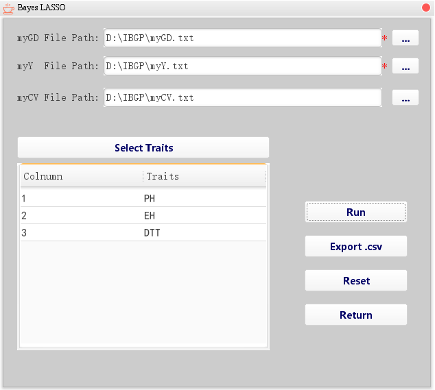

<p align="center">
    <a href="https://github.com/tangyou79/IBGP">
        
    </a>
</p>

# [**I**](https://github.com/tangyou79/IBGP)ntegrated [**B**](https://github.com/tangyou79/IBGP)ayes [**G**](https://github.com/tangyou79/IBGP)enomic [**P**](https://github.com/tangyou79/IBGP)rediction

简体中文&nbsp;&nbsp;|&nbsp;&nbsp;[English](./README.md)

## 作者
> [YouTang](https://github.com/tangyou79) &nbsp;&nbsp; :e-mail:tangyou@neau.edu.cn


## 运行

### Environment Setup
在运行IBGP前需要安装JAVA 8，并配置环境变量
请[点击这里](https://www.java.com)下载对应系统版本的JRE

### Windows
双击`IBGP.jar`运行或使用命令行：
```
Java -jar IBGP.jar
```

### Linux
双击`IBGP.jar`运行或使用命令行：
```
Java -jar IBGP.jar
```

### macOS
双击`IBGP.jar`运行或使用命令行：
```
Java -jar IBGP.jar
```

## 演示数据（部分）

### myGD file

| P1_P2 | 2 | 2 | 2 | 1 | 1 | 1 | 1 |
| --- | --- | --- | --- | --- | --- | --- | --- |
| P1_P3 | 2 | 2 | 2 | 1 | 1 | 1 | 1 |
| P1_P4 | 2 | 2 | 2 | 1 | 1 | 1 | 1 |
| P1_P5 | 1 | 1 | 1 | 0 | 0 | 0 | 0 |
| P1_P6 | 1 | 1 | 1 | 0 | 0 | 0 | 0 |


### myY file

| X.Trait. | PH | EH | DTT |
| --- | --- | --- | --- |
| P1_P2 | 223.7585496 | 88.29164095 | 47.40538302 |
| P1_P3 | 240.0252496 | 105.1436409 | 49.01718302 |
| P1_P4 | 232.8344496 | 97.47484095 | 48.92828302 |
| P1_P5 | 228.8022496 | 89.71424095 | 48.54428302 |
| P1_P6 | 250.1101496 | 114.0018409 | 49.26218302 |


### myCV file

| -68.2396078760201 | 23.1525304355525 | -41.0961434301125 | 36.5682180045708 | -3.69405339147004 | 4.98495585898516 |
| --- | --- | --- | --- | --- | --- |
| -74.9032956251602 | 20.767585847699 | -43.697857458145 | 43.2761189578619 | -3.86377512531485 | 8.56161119124162 |
| -76.604751613239 | 21.5923289571612 | -42.8578115333147 | 43.609439583042 | -0.989752431468391 | 9.19294122077025 |
| -25.1079110279177 | 62.1911660296882 | -44.6513789819871 | 7.9873348094602 | -6.40720786852947 | 13.291330493149 |
| -11.0908486876666 | 80.1287745859171 | 1.24592963263595 | 27.4016713021755 | -2.61220131841632 | 13.6389407093273 |
| -35.6191949009139 | 63.6032586024814 | -42.5473716481385 | -3.48591553665784 | -3.18754005544013 | 14.6546671280942 |


## 示例


### 主界面
IBGP包含六个功能，分别为 `Bayes  LASSO`、`Bayes A`、`Bayes B`、`Bayes C`、`Bayes CPI`、`Best Bayes`
点击图标进入对应的功能


### Bayes LASSO

点击三个`...`按钮可分别选择`GD文件`、`Y文件`和`CV文件`(CV文件可选)



点击`Select Traits`按钮可以选择要计算的性状


点击`Run`按钮开始计算，计算完成后可以点击`Export.csv`按钮将计算结果导出为csv文件

点击`Reset`按钮可以清除当前界面输入框的文字
点击`Return`返回主界面


### Bayes A

点击三个`...`按钮可分别选择`GD文件`、`Y文件`和`CV文件`(CV文件可选)
选择文件后输入两个值，分别是`burn.in`和`burn.out`。
选择性状的使用与Bayes LASSO相同。


### Bayes B

点击三个`...`按钮可分别选择`GD文件`、`Y文件`和`CV文件`(CV文件可选)
选择文件后输入三个值，分别是`burn.in`、`burn.out`和`Pi`。
选择性状的使用与Bayes LASSO相同。


### Bayes C

使用方法与Bayes B相同，此处不再赘述。


### Bayes CPI

使用方法与Bayes B相同，此处不再赘述。

### Best Bayes

Best Bayes 功能是将前五种功能结合到一起，自动选择最优结果的功能，在前五个功能的基础上多了两个参数，分别是`Group`和`Times`


